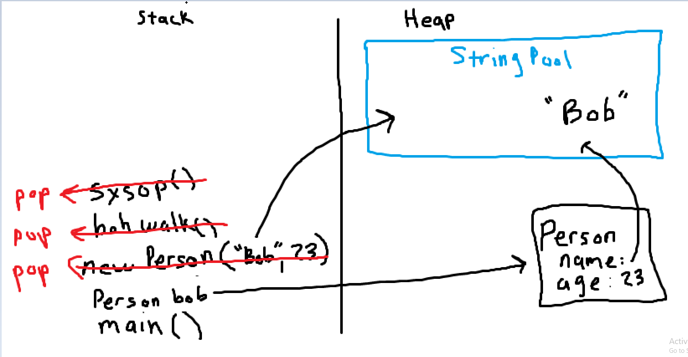
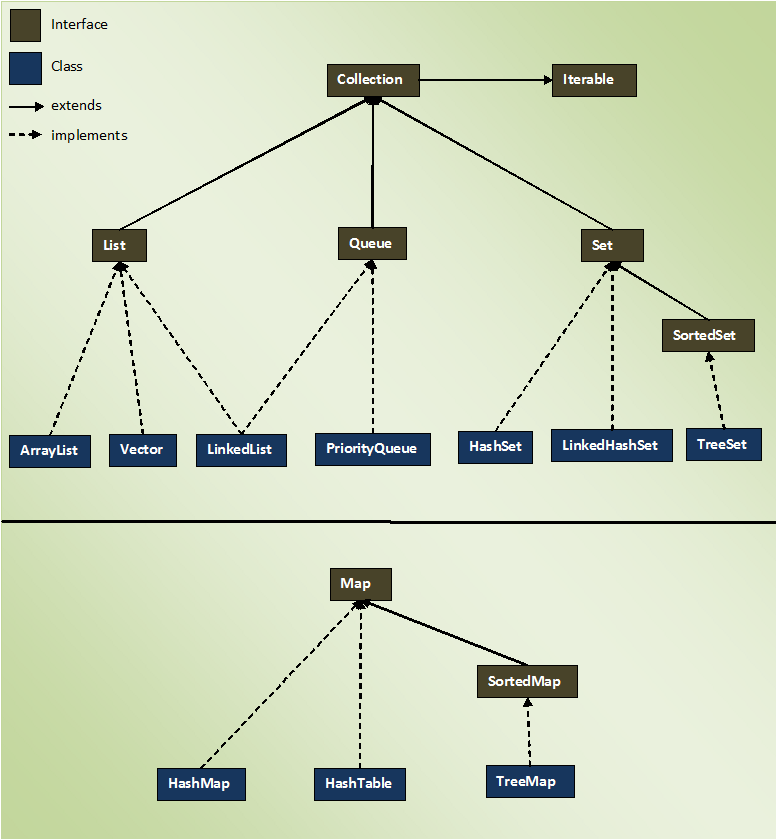

# Java Program Memory

## Heap Memory

Memory for objects in the program

- This stores the reference to objects that we create throughout our program
- When we use the new keyword this will store an object in the heap
- If we run out of heap memory, this causes an OutOfMemoryError

## Stack Memory

Memory that holds method calls, primitive values, and references to objects needed for method calls

- The stack follows First in Last Out
- When a method/constructor is called, its put on the top of the stack
    - Any values or references needed will be found in the heap
    - When the method or constructor is finished, it is popped off the top of the stack, until the program has no method calls left
- If we run out of stack memory, a StackOverflowError occurs



# Collection Framework

The Collection API is a framework of classes and interfaces in Java that implement the most 
commonly used data structures

**ALMOST** every class in the collection API extends the Iterable interface

- Exception is the Map class

# Iterable and Iterator Interfaces

## Iterable interface

define data structures that can be directly traversed using the .iterator() method

## Iterator Interface:

contains methods for traversing linear data structures, these include methods like:
- hasNext()
- next()
- remove()

Any class that implements Iterable can also be used with enhanced for loops

Classes that implement the Iterable interface also have the .forEach() method, which allows users to iterate through the data structure and perform some logic a lambda expression

With java, we want our data structures from the collections api to be able to store any datatype we want

# Generics

Are constructs in Java which enforce compile time type safety by allowing you to use paremeterized types

- These are heavily used with Collections API

They are essentially place holders for a future datatype that helps us enforce type safety

Generics can be delcared on a class, method parameters, or return types

With generics you can restrict a class to only accept objects of a given type and the compiler will prevent you from using those other types

To make a class or interface generic, use angled brackets `ClassName<T>` when declaring it, and use an arbitrary "generic type" which is determined when invoking the code

Naming conventions for Generics:
- E => Element
- K => Map key
- V => Map Value
- N => Number
- T => Generic

# Implementation of the Collection Interfaces

## Lists

The most basic datatype, a collection of ordered data, the order is preserved

- Duplicate entries are allowed
- Elements are accessed by their index, which starts at 0

ArrayList: a class which implements the List interface, and contains an array inside of
- The array is resizable, once it reaches the max capacity it increases in size by 50%
- You can traverse it quickly via index
- Insertion and deletion is slower, because it may have to resize the internal array

LinkedList: a class which implements the List and Queue interface which is composed of nodes that refernse one another
- Insertion and deletion is relatively quick
- Retrieving a specific index will be slower, because we have to traverse all the way to that index

Vector: an older class which implements the List interface, which is a threadsafe ArrayList
- Double the array when more space is needed

Stack: an older class which implements the List interface, used to implement the stack data structure
- But now we typically use a Deque

## Sets

A collection of data that is NOT ordered and it does NOT contain duplicates
- does not preserve the order in which elements are inserted

HashSet: a class which implements the Set interface and is backed by a Hashmap
- There is no ordering when iterating
- Allows one null value
- Allows fast insertion and traversal

TreeSet: a class which implements the Set interface which maintain sorted order when the elements are inserted
- It is backed by a sorted tree
- Insertion and deletion is slow
- It cannot contain null elements
- It needs a Comparator to know how to order the elements

## Queues

Collection of data that follows first in first out, unless otherwise specified

ArrayDeque: a class the implements the Queue and Deque interfaces, that allows programmers to have a double ended queue
- This allows us to create Stacks OR Queues with a single data structure

- It is a double ended queue
- It is going to store items in a resizable array

Useful ArrayDeque methods:
- pop()
- push()
- peekFirst()
- peekLast()
- pollFirst()
- pollLast()
- offerFirst()
- offerLast()

Priority Queue: a class which implements the Queue interface which order elements on their natural ordering
- This one also uses a Comparator

## Maps

Data structures that uses key/value pairs to store and retrieve data

The Map interface does NOT implement the Collection interface, however it is still considered part of the Collections API

You cannot iterate over a Map, because it does not implement the Iterable interface, you can iterate through different values in the map
- use the entrySet() method to iterate over the set of Map.entry
- use keySet() method to iterate over the set of keys
- use values() to return a Collection of values which can be iterated over

HashMap: a class which implements the Map interface
- Stores elements in a key/value pair
- Intersetion and retrieval
- Tradeoff is that it does not maintain insertion order
- Permits one null key, and mulitple null values

TreeMap: a class which implements the Map interface
- Stores its keys in a tree structure
- Insertion and retrieval is slower
- Cannot contain null keys

HashTable: an older class which implements the Maps interface
- Cannot contain null keys or null values

## Graphical interpretation of the Collection Interface


# Comparable and Comparator Interfaces

## Comparable

an interface which defines the natural ordering for class/objects

- The class must implement the Comparable interface and implement the compareTo() method

The compareTo() method should return:
- 0 if the two objects are equal
- \<0 if "this" object is smaller than the one passed into the parameter list
- \>0 if "this" object is larger than the one passed into the parameter list

## Comparator

an interface that allows you to define total ordering on some collection of objects
- You can implement the Comparatyor interface, but are not required to implement the .compare() method

# collections vs Collection vs Collections
- collections are just a collection of entities
- Collection is the interface within the Collections API
- Collections is a utility class that has static convient methods that operate on data structures in the Collections API

# Wrapper Classes

For every primitive in Java, there is a wrapper class with the same name, but capitalized
- These allow us to treat primitives like objects
- Allows us to store primitive like values in things like Collections

The Wrapper classes include:

| Primitive | Wrapper Class |
|-----------|---------------|
| boolean   | Boolean |
| byte      | Byte |
| short     | Short |
| char      | Character |
| int       | Integer |
| long      | Long |
| float     | Float |
| double    | Double |

Autoboxing: when you pass a primitive argument into a parameter that asks for its Wrapper equivalent, Java will automatically wrap the primitive into its wrapper form

Unboxing: when you passed a wrapper object into a parameter that asks for a primitive, Java will automatically convert the wrapper object to a primitive value

# Enhanced for loops

Java has a special for loop syntax for Collections of Items

Instead of having a looping variable, condtion, and increment, you can simply tell java to loop through the specified Collection

The syntax looks like this:

- `for(Object : Collection)`

java
```
List<String> stringList...
for(String s : stringList){
    do whatever you wanted on s
}
```

# Introduction to Gradle

Gradle is a software build and dependency managing tool
- It is designed for use with multiple langauges
- Allows us to write scripts for how to run or build our applications
- Automatically pulls external dependencies from repositories for us, no need to find the jar and include in our class path

Gradle comes with many prebuilt workflows to build your projects, but you can also write custom scripts in Groovey to do custom tasks

- We installed Gradle yesterday using scoop like we have used to download our other development software

## Features that make gradle popular

It high performance, gradle uses hashing methods to compare inputs and outputs of tasks, and only reruns tasks that have changed

It run on the Java platform, utilizing a JVM makes it easy to run across multiple OS's and hardware

It uses convention over configuration idealogy, which makes setting up our project super quick with the use of prebuilt plugins

It is easy to create your own tasks

Most modern ingetrated development environments support/come with gradle integration

Gradle gives developes extensize information on builds which can help identify issues

## Gradle Build Scripts

As mentioned above, gradle allows developers to write scripts based Groovy to describe how their project should be built

In gradle the build is going to consist of one or more `projects`
- A project can be anything from building a JAR to preforming some deployment process

These projects are made up of one or more `tasks`
- A task is a single unit of unit which a build performs
- By single unit of work we mean a single step in the process of the build, such as compiling a class, or running a unit

Our script is stored in build.gradle

## Gradle Dependency Management

Inside of our build.gradler file, there is a section called `dependencies`
- This is where we will declare where our dependencies are coming from/what ones we need

We will be pulling our dependencies from the Maven Repository

We add the dependency in the `dependencies` section, and gradler will go get the jar, and configure it into our project

## Gradle Project Creation

After gradle is installed, use a terminal and cd into the folder where we want the project

Run `gradle init` and follow the steps that I show you

# Packages

When we start generating projects with Gradle, it is going to organize our code into packages

We want to group like classes together in the same package, creating sort of a module
- Packages are named with all lowercase
- Reverse domain naming
    - `com.company.packagename`

We can also use imports to gain access to code written in different packages
- `import com.example.package.classname`
- `import com.example.package.*`

# Creational Design Patterns

These are used to deal with object creation inside of code

They help us reduce code redundancy, and complexity by giving the task of creating objects to a specific object which we can call upon when we need said object

There are several patterns, we will Looking Singleton, Factory, and Builder

## Singleton Pattern

A design pattern which allows the creation of an object only once in an application

- This object is then shared across multiple classes
- Useful for things like database connections, or services

There are two main types of singletons

- Lazy, the actual object is not created until it called upon
- Eager, gets created as soon as the application spins up

The difference between these two is when the constructor is called in the class

- The eager, the constructor is called and the singleton object is created first thing when the application starts
- The lazy, the constructor is called when you first try to get the singular instance

## Builder Pattern

a design pattern similar factory, however it allows you to build very specific objects

This helps us separate the construction of complex object from its representation so the same construction process can create different representations

- We have already seen this with the StringBuilder

# Exceptions

Exceptions are events that occur during the execution of our program that disrupt the normal flow

When an Exception occurs, Java creates an Exception object and it gets `thrown`

Exceptions a way for Java, or other developers to tell us when something has gone wrong, but we are able to recover from that problem if handled correctly

## Exceptions Class Hierarchy

Exceptions in Java follow a hierarchys starting with a class called `Throwable`
- Any class that extends the Throwable class can be thrown using the `throw` keyword

The two main classes which extend `Throwable` are `Exception` and `Error`

Errors are similar to exceptions, except they typicaly signify a worse problem, and typically cannot be recovered from

`Exception` is the parent of all exceptions in Java

`RuntimeException` extends `Exception`

## Checked or Unchecked Exception

The type of the Exception being thrown will determine which of the Two Exception classes is the parent of that Exception Object

## Checked Exceoptions

Will extend Exception

Caught at compile time
- MUST be handled by the programmer
- Child of the Exception class

Examples:
- FileNotFoundException
- ClassNotFoundException
- CloneNotSupportedException

## Unchecked Exceptions

Caught during the runtime of our application
- Not required to be handled by the programmer, typically going to be thrown by a bug
- Child of the RuntimeExeption class

Examples:
- ArithmeticException
- IndexOutOfBoundsException
- NullPointerException

## Handling or Declaring Exceptions

As mentioned above, all checked excpetions must be handled by the programmer

There are two ways to handle these exceptions
- try/catch block
- ducking with the `throws` keyword

The try/catch/finally block allows you to enclose risky code that may throw an exception inside of the try block

The catch block takes in the specific exception you are expecting, with any logic to handle the exception inside of the block

The finally block is optional, it will run some logic regaurdless of the outcome of the try or catch block

java
```
try{
    risky code
} catch (Exception e){
    logic
} finally {
    logic
}
```

Some rules for try/catch/finally
- Multiple catches are allowed, but they must go from specific to least specific (children of Exception/RuntimeException first then Exception)
- You can catch more than one exception in a single catch block using the pipe symbols ||
- Finally is completely optional
- try/finally are legal, but a try block by itself is not

The second way of handling exceptions is called ducking

This is done by declaring that a method could throw an exception
- Use the `throws` keyword in the method declaration

This tells Java that is is whatever entity that calls the methods responisibility to handle the exception

## How to manually throw an exception

Inside of our program there may be a time where we want to manually throw an exception

To do so we use the `throw` keyword along with creating a new Exception object

`throw new Exception()`

## Custom Exceptions

Programmers are able to create our custom exceptions to be thrown when something specific to our program occurs

This help other developers using the program/library you created know what they did wrong

Or you could use these to log things going wrong inside of your application

To create a custom exception you can do one of two things:

- Extend the Exception class to create a checked exception
- Extend the RuntimeException class to create an unchecked exception