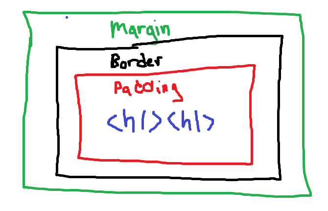

# HTML:

Hypertext Markup Language

- Hypertext refers to the ability to link pages to one another
- Markup refers to the fact that is it NOT a programming language, rather it describes how a webpage should look
- It is the standard for displaying webpages on the internet

HTML uses what are called elements and attributes to create the structure and content of the webpage

# HTML Elements, Tags, and Attributes

## Elements and Tags:

provide the structure of the HTLM document

To create an element you use a tag
- Tags are enclosed with angle brackets <>
- Most elements need an opening and closing tag, the closing tag has a backslash in it `</>`, this indicates the end of the element
- Some tags are self closing, they do not require a closing tag, they include the backslash in the closing tag

## Types of elements

Block-level elements will render their content on a new line by default

Inline elements will render next each other on the same line

## Common HTML Elements:

`

`:
- This is a block level element denoting a division of the page that typically will hold/group other elements

`

` (paragraph):
- This is a block level element denoting a block of text

``:
- Allows you to group inline elements

` ` (Break line):
- Self closing tag that is block level, and adds a line of whitespace to your webpage

`</img>`(Image tag):
- Self closing inline tag, which allows you to add an image to your webpage

`<h1></h1>` through `<h6></h6>`
- Block level elements denoting a heading text, h1 is the largest, and h6 is the smallest

`` (anchor):
- Inline element that is used to create a hyperlink (how we link different HTML pages to one another)

## HTML Attributes:

Are key/value pairs that give metadata about the tag that is important for the browser to know

- These are specified inside of the opening tag
- Can be thought of as paremetering defining a specific attribute
- Primarily used for selecting a specified element by said attribute, and either stlying it, or modifying it with Javascript

There are some global attributes that can be applied to all elements/tags in html
- class
- id
- hidden
- lang
- style
- title

There are also tags that have specific attributes
- `` has src and alt
- `<a>` has href

# HTML Doctype and Root Tag

## Doctype:

Every HTML document should begin special tag known as the DOCTYPE declaration
- This lets the browser know what kind of document and version it should be displaying
- We just use `HTML` for HTML 5
    - `<!DOCTYPE html>`
- This is the first line of the HTML page

## Root tag:

Every HTML document must also have a root tag `<html></html>`
- The root tag is the html tag

Everything else in the document must go inside of the root tag
- There are two other important tags that go inside of the html tag
- `<head></head>` holds information about the webpage
- `<body></body>` hold the structure/content of our page

# HTML Tables:

Used in HTML to nicely structure and display data

- `<table>`: creates a table element
- `<thead>`: creates a table row which is a header
- `<tr>`: creates a table row
- `<th>`: creates a header column
- `<tbody>`: specifies the main body of the table
- `<td>`: create a table column
- `<tfoot>`: create a footer row

Using these different table elements and css, old websites used to exclusively use tables for their layouts

# HTML Lists

Used to display a list of items
- `<ol>`: creates an ordered list (numbered list starting at 1)
- `<ul>`: creates an unordered list (bulleted list)
- `<li>`: creates invidual list items inside of the defined list
- You are allowed to have lists inside of lists

# HTML 5

The most recent version of the HTML Markup Language, it introduced the following changes:

- The DOCTYPE declaration
- Character encoding metadata in the head of your document
- The ability to embed audio and video files
- The ability to run JS in the background
- Added new/more semantic tags

## Semantic tags/elements:

Give tags descriptives names, rather than only being for functionality

Tags such as `div`, `p` asnd `span` are non-semantic

Tags such as `table` are semantic tags we already had previous to html 5

HTML 5 introduced these new Semantic tags:

- `<section>`
- `<article>`
- `<header>`
- `<footer>`
- `<nav>`
- `<aside>`
- `<figure>`
- `<figcaption>`
- `
`
- `<mark>`
- `
`
- `<time>`

## HTML 5 Audio and Video Tags

HTML also implemented the ability for you to embed audio and video onto your page

## audio tag

Use `<audio>` to embed the audio into your webpage

- `controls` attribute allows you to control the audio straight from the page
- `<source>` element is used to specify the source of the audio
    - `src` attribute to specify where to find the file
    - `type` attribute to specify the audio type
        - MP3, OGG, WAV

## Video tag:

Use `<video>` to embed your video into the webpage
- `width` and `height` attributes to control how large the video is
- `controls` does the same as the above
- `<source>` tag does the same as above
- Supported video types include: MP4, WebM, Ogg

# CSS (Cascasing Style Sheets):

sets of key/value pairs, that create rules that define how elements on webpages should look

A CSS rule is composed of selectors and declarations
- Selector is an HTML element or a set of HTML elements
- Declarations are comprised of properties and values surrounded by curly braces

## Three ways of accomplishing styling in CSS

1. Inling CSS, this is CSS applied directlt to an element in the HTML page, using the style attribute
2. Internal/embedded CSS, this is css writeen inside of a `<style>` tag inside of the head of our document
3. External CSS, this is a completely independent file that you import into your html document, this occurs in the head tag
    - use the `<link rel="stylesheet" href="style.css">` in the head to link the style sheet

# CSS Box Model:

The box model is used to determine how the webpage is rendered by the browser
- Every element in the web page is a series of boxes, that CSS is able to modify

## The four parts of the box model
- Margin: is the outer most retangle
- Border: is the area between the margin and padding
- Passing: is the area between the content and the border
- Content: whatever the element is displaying

# CSS Properties

There are numerous properties that we can adjust to style different elements on our webpage
- border: allows you to change how the border looks
- padding: allows you to change the distance between the content and the border
- margin: allows you to change how much space is between the elements
- display: allows you to change the behavior of how to render the elements
- position: allows you to move the elements where you want them on the page
- color: allows you change the color of the content/element
- background: allows you to change the background
- text-align: allows you to alig text content inside of the element

# CSS Selectors:

used to select specific elements or groups of elements to be styled on the webpage

There are many many ways including:

- Element Selector: select all elements by tag (p {}, h1 {})
- Id selector: select a specific element by an id (#id {})
- Class selector: selects all elements with a given class attribute (.classname {})
- Univeral selector: select all elements on the page `* {}`
- Attribute selector: select all elements with the specified attribute (`[atrribute] {}`)
- Grouping selector: selects a group of elements by their tag (h1, h2, h3 {})

## Specificity in CSS

In CSS you are allowed to have multiple rules for a single element, in order for the browser to know which rules to apply, there is a style hierarchy which is followed known as specificity

This is only going to apply when an element is targeted by multiple CSS declarations, the order of specificity is as follows

1. Inline CSS
2. ID selector
3. Class Attribute and Pseudo class selector
4. Element and Psuedo-element selectors

W3 Schools is my number 1 recomendation for helpful tips on HTML and CSS

https://www.w3schools.com/