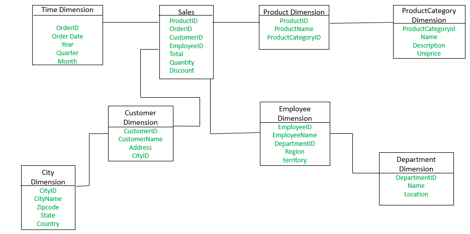

# Big Data Overview

Big data is just large amounts of data, amounts so large that we had to create and design new tools to handle all of it

The dividing line for "Big Data" is more about the tool being used rather than specific amount of data
- If you are using a tool that falls under the big data umbrella, then considered big data

Why is big data a thing?

The amount of data being stored in computer systems has historically grown exponentially

Couple this with storage becoming cheaper and cheaper, more and more data can then be stored to be worked with

The tools for working with data have traditionaly been limited in scope and so new generatations of tools have to be invented to deal with problems caused by unforseen large data sets

## Our history of data tools

Data was orginally stored in glorified spread sheets

Those became too much to handle so we create relational databases

Relational Databases are slowly being phased out for unstructured NoSQL databases

Now things are moving towards distributed systems like Hadoop

# Hadoop Overview

Hadoop is an ecosystem or collection of tools for distributed data management. These tools are often used when dealing with big data.

Hadoop solves the problems of big data by spreading the data and the proccessing of that data across multiple machines

The distributed nature of Hadoop means that it can achieve equivalent processing of a modern super computer (or beyond) at radically lower prices using common machines, these machines can even be virtual like AWS EC2's

Hadoop is made up of several major modules:

- Hadoop Common: the base libraries and utilities that all Hadoop modules depend on
- Hadoop YARN: platform for managing compute resources
- Hadoop MapReduce: used for distributive data proccesses
- Hadoop Distributed File System: file sysytem for storing information/data in Hadoop

There are many software offerings that use Hadoop under the hood to acheive some broad functionality, like Apache Hive, Or Apache Sqoop

Hadoop is primarily written in Java which allows us to take advantage of Write Once Run Anywhere

# HDFS as Data Source

This is Hadoops file System, this is like a file system on single machine, separated into folders that contain files, but it spread out and duplicated across multiple machines

Because of the distribution, it is massively scalable, proven up to 100pb data

HDFS is fault tolerant, it assumes that outages happen normally, and not that they are anomalies

Hadoop will create duplicates of data to ensure that even if one machine goes down the data is still accessible

HDFS is self-healing, if it notices a node (a group of data blocks) is down for significant time, then the data block that were lost are reduplicated across the system

## HDFS Structure

Hadoop runs in a cluster of machines made up of nodes

Name Node: hold all the metadata for the file structure and keeps track of where all the data nodes are. This also controls the processes for replicating data blocks. This will always be supported by a secondary name node

Data Nodes: Stores the data in data blocks. A node will have many block, and these blocks are organized into "racks" and will be on a single machine. By default, the data replication has two duplicates of a block on one rack, and a third duplicate on another machine

There are external processes that will run to communicate between HDFS and other parts of Hadoop like MapReduce

## Hadoop MapReduce

This is the engine that will actually do the computing on the distributed file system

It is primarily composed of two parts:

- Job Tracker: which orchestrates and schedules tasks
- Task Trackers which are assigned proceses to run by the Job Tracker to actually perform the tasks. They will be created as close to the data nodes that are manipulating as possible.

A job will generally be broken up and distributed across multiple task trackers

Ultimately this structure allows processing to be done in parallel and therefore to be quickly and efficiently on the system

YARN in Hadoop(v2) will actually be tasked with the provisioning of resources to MapReduce for tasks

# Data Warehouse Overview

An environment/central hub for a companies entire dataset. Store literally everything extracted from a data source

Your ETL pipeline should feed data into the data warehouse, and the data should be highly strucured and standardized for analytical purposes

Typically there are three tiers to our data warehouse
- The front client that displays the results of analsis, generally as reports. This also display data mining or other results
- Analytics server that queries the data performs logic on it
- The database server that stores the data in databases

Usually our data warehouse are going to be based on extremely effiecent SQL databases, because they have to store 100 of thousands to 100's of millions of records from companies

## Data warehouse vs Traditional Databases

Data warehouse are designed for complext, resource intensive analytics and reporting over large conglamorates of data sets, while traditional database are used primarily for transaction processing

Data warehouses have collections of data from many sources, while traditional databases capture data from a singular source

Data warehouses will have a schedule of activities, like bulk writes to the warehouse, while traditional databases are optimized for continouous event driven operations

Data warehouses will generally use a Star Scheam or a Snowflak Schema as opposed to a normalized schema

Data warehouses are often columnar in storage, they store data by column instead of rows. While traditional databases will store information by rows.

## Data Lakes

Centeralized repositories for all data in a company or large organization

Unlike data warehouses it can store structured, unstructured, or semi-structured data

Datalakes can be SQL, NoSql, or even some massive excel sheet somewhere

These will typically be used as input for our ETL pipeline. Where the output of the transformed data is going to be stored in the data warehouse.

These will overall be cheaper because they overall store less data, and are less effiecient that our larger "faster" data warehouses

# Data Warehouse Vendors

Most our super popular cloud providers are going have some sort of data warehouse service with various pricing. Many of these will charge by the terrabyte of data stored per month.

Some Cloud vendors include:
- Amazon Redshift
- Google BigQuery
- Azure Synapse Analytics
- Db2 Warehouse on the Cloud
- Snowflake

# Data Marts

Smaller, specialized data warehouses, typically composed of a subset of a larger data warehouse

Data marts will focus on a single subject area, or a part of the company so there is an independent that department or until of the company can go to for its analytics

The smaller size of the marts allows for independent and targeted analytics to be run on the relevant data

# Star Schema

An unnormalized relational database schema often used in a data warehouse

The schema has a fact table in the center, and any number of dimensional tables around it. This creates a schema that looks like a stare

The fact table should contain specific measurable primary data to be used in analysis. This ultimately means that it is the center table of the schema with foreign keys to all the dimension tables

Dimension Tables examples can include:
- Simple queries
- Simplified Analytics
- Fast Aggregation
- OLAP cube feeding

Disadvatanges of Star Schema

- Data is not as flexible as a normal schema
- Data integrity generally enforced by normalization is easily broken
- Many to many relationships are not represented
- High redundancy of data

## Snowflak Schema

Another common data warehouse schema that is similar to the star schema, but the dimension have some degree of normalization

The produces sub-dimensional tables that are referenced by Foreign Keys in the primary dimension table

Advantages:
- Data redundancy is reduced allowing for reduced storage needs
- More flexibility in data drawn from queries

Disadvantages:
- Additional complexity in queries

## Amazon Redshift Demo

https://docs.aws.amazon.com/redshift/latest/gsg/sample-data-load.html